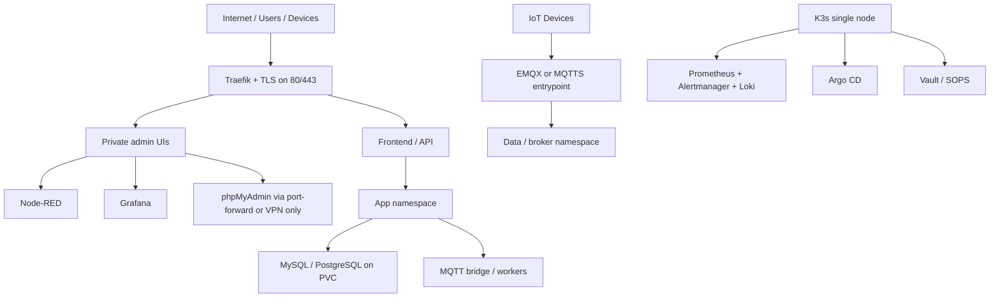

# Thermexpertise Single-Node Architecture

## Executive Summary

The image you attached describes a single Ubuntu 24 server hosting SSH, MQTT, Node-RED, Grafana, MySQL/phpMyAdmin, and a public company domain. That layout is workable for a lab, but not safe for a 24/7 production environment if implemented directly.

This repo should use a hardened single-node Kubernetes architecture:

- Ubuntu 24 LTS as the host OS
- K3s as the orchestration layer
- Traefik as the only public HTTP/HTTPS entrypoint
- cert-manager for Let's Encrypt certificates
- Argo CD for GitOps deployments
- Vault or SOPS-managed Kubernetes secrets
- Prometheus and Grafana for health, capacity, and alerting
- Persistent volumes for stateful workloads

## Immediate Security Actions

Rotate every password shown in the image immediately.

- SSH root password
- MQTT admin password
- Node-RED admin password
- Grafana admin password
- MySQL root password
- phpMyAdmin access

Do not keep those credentials in screenshots, docs, chat history, or Git.

## Target Topology

## Mapping From Your Image To Best Practice

### Ubuntu 24

Keep Ubuntu 24 LTS, but add:

- automatic security updates
- UFW with default deny
- SSH keys only
- `PermitRootLogin no`
- `PasswordAuthentication no`
- fail2ban
- NTP and disk monitoring

### Admin console / aaPanel

Do not make aaPanel the control plane for this stack.

Use:

- Argo CD for deployment management
- Grafana/Prometheus for monitoring
- Traefik for ingress
- Vault for secrets

If aaPanel is required for a separate WordPress site, isolate it from the application workloads and do not let it own the core app routing.

### SSH

Do not operate the server with public root-password login.

Use:

- a named sudo user
- SSH keys
- IP allowlist or VPN for admin access
- separate break-glass credentials stored offline

### MQTT Broker

For 24/7 production:

- prefer EMQX for external MQTT traffic
- expose `8883` with TLS for public devices
- keep plain `1883` internal or VPN-only
- enforce per-device credentials and ACLs
- persist broker state
- monitor broker metrics

Mosquitto is still useful for a lightweight internal broker, bridge, or edge adapter, but it should not be the only public Internet-facing broker for a critical platform.

### Node-RED

Node-RED is an admin surface, not a public app.

Best practice:

- keep it behind Traefik HTTPS
- add IP allowlist and authentication
- persist `/data`
- back up flows
- disable direct public `NodePort`

### Grafana

Grafana should be:

- private or IP-restricted
- backed by persistent storage
- connected to Alertmanager
- not published with default admin credentials

### MySQL and phpMyAdmin

MySQL must not be exposed with public `NodePort`.

Best practice:

- keep database service `ClusterIP` only
- use PVC-backed storage
- take scheduled backups
- expose phpMyAdmin only through VPN, port-forward, or tightly restricted ingress
- avoid root for application connections

### Domain Mapping

For `thermexpertise.com`, use clean subdomain separation:

- `thermexpertise.com` or `www.thermexpertise.com` for the company/app entrypoint
- `api.thermexpertise.com` for APIs
- `grafana.thermexpertise.com` for monitoring
- `nodered.thermexpertise.com` for Node-RED admin

Keep the current Wix/WordPress company site separate from the operational platform unless you intentionally migrate it behind the same gateway.

## Operational Rules For 24/7 Reliability

### Networking

- public ingress only on `80/443`
- no public raw `NodePort` for admin tools
- TCP MQTT exposure only when intentionally designed
- namespace-scoped network policies for east-west traffic

### Persistence

- Node-RED on PVC
- MySQL/PostgreSQL on PVC
- broker state on PVC
- Prometheus and Grafana on PVC

### Deployment

- GitOps via Argo CD
- one production overlay per environment
- no `latest` tags in production
- health probes on every long-running workload

### Security

- secrets outside Git
- TLS everywhere possible
- IP allowlists for admin surfaces
- least-privilege service accounts
- rotate credentials periodically

### Observability

- uptime alerting
- disk and memory alerting
- TLS expiry alerting
- backup success alerting
- broker queue and connection alerting

## Repo Changes Applied

The repo has been updated to move toward this target state:

- `k3s/install.sh` now keeps Traefik enabled and tightens firewall defaults
- `argocd/platform-stack/cert-manager.yaml` adds certificate automation
- `traefik/thermexpertise-single-node.yaml` provides a production ingress template
- `Node-RED`, `Mosquitto`, `MySQL`, and `phpMyAdmin` manifests are being shifted away from raw public exposure toward private, persistent services

## Recommended Next Infra Step

The next high-value step after these repo changes is to create production secrets outside Git and wire the admin endpoints behind either:

- office IP allowlists, or
- a VPN / zero-trust access layer
